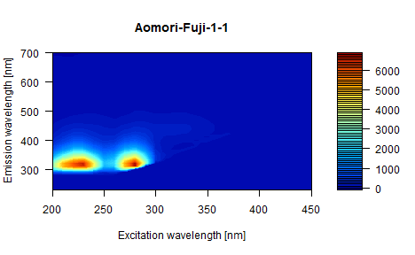
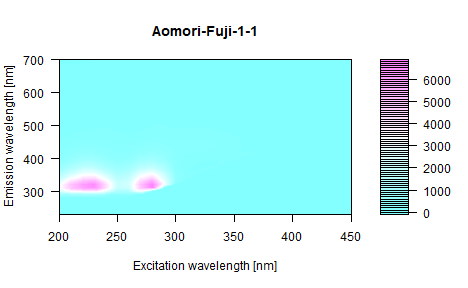
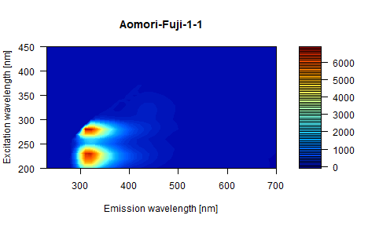
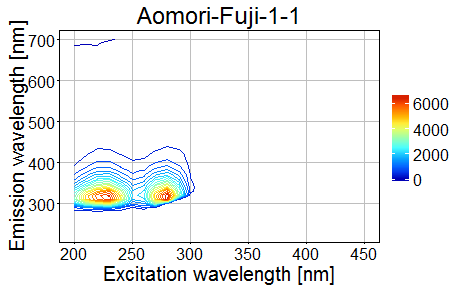
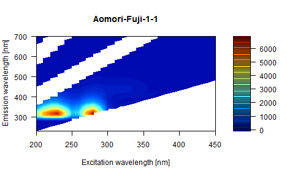
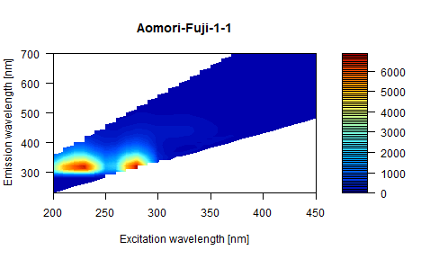
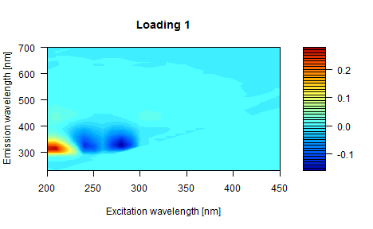
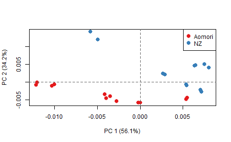
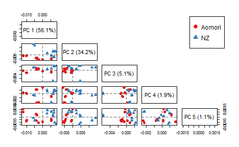
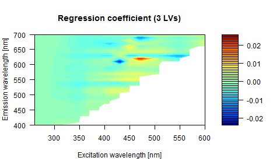

<!--
%\VignetteEngine{knitr::knitr}
%\VignetteIndexEntry{Introduction to EEM package}
-->


# Introduction to EEM package
edited on 2016.01.22

## Table of contents

- [Introduction](#intro)
- [Importing raw data files](#import)
- [Visualizing EEM data](#visualize)
    - [`drawEEM`](#drawEEM)
    - [`drawEEMgg`](#drawEEMgg)
- [Preprocessing EEM data](#preprocess)
    - [Delete Rayleign scattering rays](#delScattering) 
        - [`delScattering`](#delScattering1)
        - [`delScattering2`](#delScattering2)
    - [Cutting portion of EEM](#cutEEM)
    - [Unfolding 3-d data into 2-d data for multivariate analysis](#unfold)
    - [Normalize](#normalize)
- [Exporting data matrix to other stats softwares](#export)
- [Analyzing EEM data in R](#analyze)
    - [Principle Component Analysis (PCA)](#pca)
    - [Partial least-squares (PLS) regression](#pls)
- [References](#ref)

## <a name="intro"></a>Introduction
Fluorescence fingerprint or more commonly known as complete fluorescence excitation-emission matrix (EEM) is a 3-dimensional data consisting of excitation, emission and intensity axis. The multi-dimension set EEM data apart from other signal processing. Thus, `EEM` package was developed to facilitate data analysis in R. Basic tools for importing raw data files, deleting Rayleigh scattering rays, unfolding 3-dimensional to 2-dimentional matrix (and vice versa) for further multivariate analysis, and visualizing data are provided in this package. The author has intended this package to be used as a bridge between raw data files and other analysis tools. 

## <a name="import"></a>Importing raw data files
`readEEM` function can read raw data files into R. Currently the supported raw data files are limited to certain fluorescence spectrometers (see `?readEEM` or [impoting raw files vignette](https://github.com/chengvt/EEM/blob/master/vignettes/file-io.md) for more details). Basically `readEEM` will look for a certain keyword in raw files and start to read in the lines below them. Please send a word or pull request to add support for other formats. 

Raw data files can be imported using any of the commands below. It can accept both file and folder path. Multiple paths can be specified using a vector. 


```r
library(EEM) # load library

# read raw data files from a file
data <- readEEM(file) 
data <- readEEM("sample1.txt") # read in a file
data <-readEEM(c("sample1.txt", "sample2.txt")) # read in two files

# read raw data files from a folder
data <- readEEM(folder) 
data <-readEEM("C:\\data") # full path. Note that the slash is doubled.
data <- readEEM("C:/data") # read in all files in data folder. Aside from double slashes,
                           # a reverted slash can also be used. 

# read raw data files from the current working folder
setwd(choose.dir()) # set working folder interactively (only work in windows)
data <- readEEM(getwd()) # read raw data files in current working folder
```

The data is imported as a `list` and was given a class name of `EEM`. The original file names are can be retrieved using `names(EEM)`, and additional information can be obtained using `summary(data)`. 

For demonstation purpose, a dataset called "applejuice" is attached with the package. It can be called by `data(applejuice)`. More information about the dataset can be accessed by `?applejuice`. 


```r
# load dataset
data(applejuice) 
class(applejuice) # EEM class
```

```
## [1] "EEM"
```

```r
# get sample names
names(applejuice)
```

```
##  [1] "Aomori-Fuji-1-1"  "Aomori-Fuji-1-2"  "Aomori-Fuji-2-1" 
##  [4] "Aomori-Fuji-2-2"  "Aomori-Jona-1-1"  "Aomori-Jona-1-2" 
##  [7] "Aomori-Jona-2-1"  "Aomori-Jona-2-2"  "Aomori-Ohrin-1-1"
## [10] "Aomori-Ohrin-1-2" "Aomori-Ohrin-2-1" "Aomori-Ohrin-2-2"
## [13] "NZ-Envy-1-1"      "NZ-Envy-1-2"      "NZ-Envy-2-1"     
## [16] "NZ-Envy-2-2"      "NZ-Fuji-1-1"      "NZ-Fuji-1-2"     
## [19] "NZ-Fuji-2-1"      "NZ-Fuji-2-2"      "NZ-Jazz-1-1"     
## [22] "NZ-Jazz-1-2"      "NZ-Jazz-2-1"      "NZ-Jazz-2-2"
```

```r
# use summary to see information about the dataset.
summary(applejuice)
```

```
## Number of samples: 24
## Sample names: 
##  [1] "Aomori-Fuji-1-1"  "Aomori-Fuji-1-2"  "Aomori-Fuji-2-1" 
##  [4] "Aomori-Fuji-2-2"  "Aomori-Jona-1-1"  "Aomori-Jona-1-2" 
##  [7] "Aomori-Jona-2-1"  "Aomori-Jona-2-2"  "Aomori-Ohrin-1-1"
## [10] "Aomori-Ohrin-1-2" "Aomori-Ohrin-2-1" "Aomori-Ohrin-2-2"
## [13] "NZ-Envy-1-1"      "NZ-Envy-1-2"      "NZ-Envy-2-1"     
## [16] "NZ-Envy-2-2"      "NZ-Fuji-1-1"      "NZ-Fuji-1-2"     
## [19] "NZ-Fuji-2-1"      "NZ-Fuji-2-2"      "NZ-Jazz-1-1"     
## [22] "NZ-Jazz-1-2"      "NZ-Jazz-2-1"      "NZ-Jazz-2-2"     
## Dimension [EmxEx]: 48x26
## EX range: 200~450 [nm]
## EM range: 230~700 [nm]
```


## <a name="visualize"></a>Visualizing EEM data
EEM data is usually visualized using a contour representation. Two functions are available for creating contours. 

### <a name="drawEEM"></a>drawEEM
`drawEEM` is built based on `filled.contour` of `graphics` package and can be used to draw any sample of an `EEM` class object. 


```r
# draw EEM of sample no.1
drawEEM(applejuice, n = 1) 
```



```r
# draw EEM of sample no.1 with different color
drawEEM(applejuice, n = 1, color.palette = cm.colors) 
```



The axis can also be flipped by setting `flipaxis` to TRUE.

```r
# flip the axis
drawEEM(applejuice, n = 1, flipaxis = TRUE) 
```



### <a name="drawEEMgg"></a>drawEEMgg
`drawEEMgg` is an alternative contour creator. It uses `ggplot2` package to draw contour. The big merit of using `drawEEMgg` over `drawEEM` is its support for the uneven spacing of wavelengths (ie. 200.5 201.7 203.1 ... 230.5 nm). 


```r
# draw EEM of sample no.1
drawEEMgg(applejuice, n = 1) 
```


```r
# all functionalities in ggplot can be applied directly 
library(ggplot2)
# add grid line to the plot
drawEEMgg(applejuice, n = 1) + theme(panel.grid = element_line(color = "grey"), 
                                     panel.grid.major = element_line(colour = "grey"))
```



## <a name="preprocess"></a>Preprocessing EEM data
Raw EEM data typically requires data cleaning, although some recent machines produced thoroughly cleaned data. Many papers (Fujita et al. (2010), Murphy et al. (2013)) have already discussed about the methods for cleaning and processing EEM data. 

### <a name="delScattering"></a>Delete Rayleign scattering rays
#### <a name="delScattering1"></a>`delScattering`
The Rayleign scattering rays of different orders can be deleted using `delScattering`. It is possible to choose whether to fill in the blank with NA or 0 by specifying `rep` (replace) argument. By running this function, the regions unrelated to fluorescence (where Em < Ex) will be also be deleted. 


```r
# delete scattering regions and assign them as NA
applejuice_delS <- delScattering(applejuice, rep = NA) 
drawEEM(applejuice_delS, 1)
```



The width of each region to be deleted can also be set manually. The default values can be viewed through `?delScattering`. 


```r
applejuice_delS <- delScattering(applejuice, rep = NA, first = 30, second = 0, third = 0, forth = 0) 
drawEEM(applejuice_delS, 1)
```


`rep` was set to NA for demonstration purpose. However, since missing values cannot be included in some multivariate analysis, `rep` should be set to 0.


```r
applejuice_delS <- delScattering(applejuice, rep = 0, 
                                 first = 30, second = 0, third = 0, forth = 0) 
```

#### <a name="delScattering2"></a>`delScattering2`
`delScattering2` is different from `delScattering` in the way that the region beyond 
the second-order scattering ray is removed, in addition to the regions where emission wavelength is shorten than excitation light (Em <= Ex) and the first- and second-order scattering rays.


```r
drawEEM(delScattering2(applejuice, NA), 1)
```



### <a name="cutEEM"></a>Cutting portion of EEM
`cutEEM` function offers a method to cut portions of EEM by specifying `cutEX` and `cutEM` argument values. However, please take note that it is not possible to cut portion in the middle. 


```r
applejuice_delS_cut <- cutEEM(applejuice_delS, cutEX = 350:500, cutEM = 500:700)
drawEEM(applejuice_delS_cut, 1)
```


### <a name="unfold"></a>Unfolding 3-d data into 2-d data for multivariate analysis

EEM data can be unfolded into a matrix with columns as variables (wavelength conditions) and rows as samples, which is a common format for multivariate analysis. 


```r
## unfold EEM into EEM_uf (matrix form with samples x variables dimension)
applejuice_delS_uf <- unfold(applejuice_delS) 

# dimension of unfolded data
dim(applejuice_delS_uf)
```

```
## [1]   24 1248
```

```r
# take a look at unfolded data
applejuice_delS_uf[1:5 ,1:5]
```

```
##                 EX200EM230 EX200EM240 EX200EM250 EX200EM260 EX200EM270
## Aomori-Fuji-1-1   1.584740   2.750280    2.71587    6.51603    21.1658
## Aomori-Fuji-1-2   0.480644   2.064270    4.72847    5.65419    27.9555
## Aomori-Fuji-2-1   2.430540   1.427630    3.28927    5.36893    23.0553
## Aomori-Fuji-2-2   0.461552   2.157030    3.26636    5.78505    28.7779
## Aomori-Jona-1-1  -0.170955   0.362999    2.46317    6.07851    22.4464
```

Unfolded data can also be folded back into EEM class by `fold` function.

### <a name="normalize"></a>Normalize
Unfolded data can be normalized using `normalize` function to adjust the scaling difference, which is a common bias in spectroscopic applications. This difference can be caused by the scattering effect, source/detector variation and instrumental sensitivity. `Normalize` function will do the row processing of the unfolded data by divide each variable by the sum of the absolute value of all variables for the given sample. The output will return a matrix where each row is a vector with unit area (area = 1). 


```r
# normalize data
applejuice_delS_uf_norm <- normalize(applejuice_delS_uf) 

# the absolute sum of each row should equal to 1
rowSums(abs(applejuice_delS_uf_norm)) 
```

```
##  Aomori-Fuji-1-1  Aomori-Fuji-1-2  Aomori-Fuji-2-1  Aomori-Fuji-2-2 
##                1                1                1                1 
##  Aomori-Jona-1-1  Aomori-Jona-1-2  Aomori-Jona-2-1  Aomori-Jona-2-2 
##                1                1                1                1 
## Aomori-Ohrin-1-1 Aomori-Ohrin-1-2 Aomori-Ohrin-2-1 Aomori-Ohrin-2-2 
##                1                1                1                1 
##      NZ-Envy-1-1      NZ-Envy-1-2      NZ-Envy-2-1      NZ-Envy-2-2 
##                1                1                1                1 
##      NZ-Fuji-1-1      NZ-Fuji-1-2      NZ-Fuji-2-1      NZ-Fuji-2-2 
##                1                1                1                1 
##      NZ-Jazz-1-1      NZ-Jazz-1-2      NZ-Jazz-2-1      NZ-Jazz-2-2 
##                1                1                1                1
```

## <a name="export"></a>Exporting data matrix to other stats softwares
After preprocessing and unfolding, the data matrix can be exported as text files to be analyzed by other stats softwares. Note that [further analysis is also possible in R](#analyze). 


```r
# export as csv file
write.csv(applejuice_delS_uf, "applejuice.csv") 
```

After analysis with other softwares, the returned values such as regression coefficient or VIP value can be imported back in R so that contours can be easily plotted. The detailed walk through can be found in [impoting raw files vignette](https://github.com/chengvt/EEM/blob/master/vignettes/file-io.md#datamatrix_import) for more details)

## <a name="analyze"></a>Analyzing EEM data in R

### <a name="pca"></a>Principal component analysis (PCA)
`prcomp` of `stats` package can be used to perform PCA on the unfolded data. 


```r
# perform PCA
result <- prcomp(applejuice_delS_uf_norm) # mean-centering is enabled by default

# plot scree plot
screeplot(result, npcs = 10, type = "lines", main = "Screeplot")
```


The score and loading can be plotted by `plotScore` and `plotLoading`, respectively.


```r
# plot score plot 
plotScore(result, xPC = 1, yPC = 2) # pc 1 vs pc 2
```


```r
# plot loading plot
plotLoading(result, ncomp = 1) # loading 1
```



For our example, PCA will be used to test whether EEM can discriminate apples of different production area and cultivars. Since those information is hidden in the sample names, they will be retrieved first. 


```r
# extract sample name
sName <- names(applejuice) 

# country of apple production
country <- sapply(strsplit(sName, split = "-"), "[", 1) 
table(country) # counts of samples grouped by country
```

```
## country
## Aomori     NZ 
##     12     12
```

```r
# cultivar of apples
cultivar <- sapply(strsplit(sName, split = "-"), "[", 2) 
table(cultivar) # counts of samples grouped by cultivar
```

```
## cultivar
##  Envy  Fuji  Jazz  Jona Ohrin 
##     4     8     4     4     4
```

To plot score plot with points colored by group, `plotScore` and `plotScorem` can be used.


```r
# plot score plot with grouping
plotScore(result, xPC = 1, yPC = 2,country, legendlocation = "topright")
```



```r
# plot score using scatterplot matrix with grouping
plotScorem(result, ncomp = 5, country)
```



```r
plotScorem(result, ncomp = 5, cultivar, cex = 1)
```


### <a name="pls"></a>Partial least-squares (PLS) regression
PLS regression can be calculated using `plsr` function of `pls` package. `plsr` function returns an output variable of the class `mvr`. The latent variables can be visualized in a contour representation using `plotLoading` function. Similarly, the regression coefficient can be visualized in a contour representation using `plotReg` function.


```r
# load gluten data
data(gluten)
gluten_uf <- unfold(gluten) # unfold list into matrix

# delete columns with NA values
index <- colSums(is.na(gluten_uf)) == 0
gluten_uf <- gluten_uf[, index]
gluten_ratio <- as.numeric(names(gluten))

require(pls)
model <- plsr(gluten_ratio ~ gluten_uf, ncomp = 3)
plotLoading(model, ncomp = 3)
```


```r
plotReg(model) 
```



## <a name="ref"></a>References
Fujita, K., Tsuta, M., Kokawa, M., & Sugiyama, J. (2010). Detection of deoxynivalenol using fluorescence excitation-emission matrix. Food and Bioprocess Technology, 3(6), 922-927.

Murphy, K. R., Stedmon, C. A., Graeber, D., & Bro, R. (2013). Tutorial Review: Fluorescence spectroscopy and multi-way techniques. PARAFAC. Analytical Methods. 
